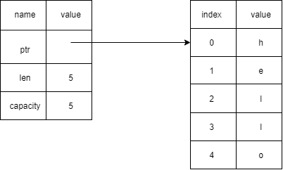
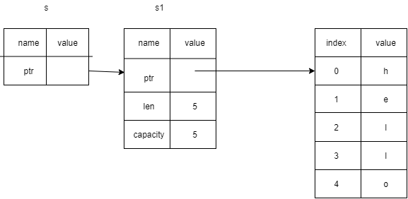

# rust基础

## 配置cargo

>进入用户目录下的 .cargo 文件夹（~/.cargo），新建一个名为 config 的文件

```toml
[source.crates-io]
registry = "https://github.com/rust-lang/crates.io-index"
replace-with = 'ustc'
[source.ustc]
registry = "git://mirrors.ustc.edu.cn/crates.io-index"
# 如果所处的环境中不允许使用 git 协议，可以把上面的地址改为
# registry = "https://mirrors.ustc.edu.cn/crates.io-index"
```

> 如果不能设置git,还要设置代理

* 在powershell中设置

```shell
$env:http_proxy="http://127.0.0.1:1080"
$env:https_proxy="http://127.0.0.1:1080"
```

* 在cmder中设置

```shell
Set http_proxy=http://127.0.0.1:1080 && Set https_proxy=http://127.0.0.1:1080
```

>使用rust文档`rustup doc`

1. 创建项目`cargo new hello_world`
2. 编译项目`cargo build`,文件产生在`targe/debug`
   * `cargo build --release`:(正式发布项目用)编译时会进行优化(时间更长)
   * 文件产生在`targe/release`
3. 运行项目`cargo run`
4. 检查代码`cargo check`:不产生任何可执行文件

>`cargo.toml`:cargo的配置格式

* \[package]:区域标题
  1. name:项目名
  2. version:项目作者
  3. authors:项目作者
  4. edition:使用rust的版本

* \[dependencies]:依赖包

>`cargo.lock`项目依赖的精确版本

* rust团队提供的库:<https://crates.io/>

## 变量与常量

>声明变量使用let关键词.并且默认情况下是不可变的(immutable)

* 使用`mut`关键词,使变量可变`let mut x = 5`

>常量(constant),常量在绑定值之后是不可变的,但是他与不可变的变量右很多区别

1. 不可以使用mut
2. 声明常量使用mut关键字,他的类型必须被标注
3. 常量可以在任何作用域内进行声明,包括全局
4. 常量只绑定到常量表达式,无法绑定到函数的调用结果只能在运行时才能计算出的值

* 例如:`const XXX_SSS: u32 = 500_000;`
* 在程序运行期间,其声明的作用域一直有效

>静态变量`static`:与let一样,static同样是一个匹配模式.(不过static声明的变量使用周期是整个程序)

```rust
static GLOBAL:i32 =0;
```

### 类型别名

>这个与很多语言相似.例如typescript

```rust
type uAge = u32;
```

### shadowing

>rust中可以使用相同的名字声明新的变量,新的变量就会shadow(隐藏)之前声明的同名变量

* 并且在后续的代码中这个变量就是新的变量

```rust
let x = 5;
let x = x + 1;
```

> shadow和mut的区别

1. 如果不适用let关键字,那么重新给非mut的变量赋值会导致编译时错误
2. 使用let声明的同名变量,也是不可变的
3. 使用let声明的同名新变量,他的类型可以与之前不同

## 数据类型

> 整数类型

1. 整数类型没有小数部分
2. 例如`u32`就是一个无符号的整数类型,占据32位的空间
   * 无符号整数类型以u开头
   * 有符号整数类型以i开头

| length | signed | Unsigned |
| ------ | ------ | -------- |
| 8bit   | i8     | u8       |
| 16bit  | i16    | u16      |
| 32bit  | i32    | u32      |
| 64bit  | i64    | u64      |
| 128bit | i128   | u128     |
| arch   | isize  | usize    |

* 范围:有符号`-(2^n -1)`到`2^n-1`.无符号0`到`2^n-1`

> isize和usize类型

* 如果isize和usize类型的位数右程序运行的计算机的架构决定
  * 如果使64位计算机,那就是64位
  * 如果是32位,那就是32位
  ...
* 使用场景主要是对isize或usize的主要场景对某种集合进行索引操作

>整数溢出

* 例如u8的范围是0-255,如果你把一个u8变量设置为256
  1. 在调试模式下:rust会检查整数溢出,如果发生溢出,rust就会panic(立即终止程序)
  2. 发布模式下(--release)编译:rust不会检查可能导致panic的整数移除
     * 如果溢出发生,rust执行`环绕`操作:256->0
     * 但是程序不会panic

> 浮点类型(带有小数类型)

* Rust的浮点类型使用IEEE-754的标准类表述
  * f32,32位单精度
  * f64,64位双精度

* f64是默认类型,在现代cpu上f64和f32的速度差不多,而且精度更高

```rs
println!("{} {}",1.0/0.0,0.0/0.0);
```

* 这个编译执行打印出的结果分别是`inf`和`NaN`.非0数除以0是无穷大(inf)

>布尔类型(bool)

* 只占用一个字节大小

>字符类型(char)

* rust语言中char类型用来描述语言中的单个字符
* 字符类型的字面值使用单引号
* 占用四个字节的大小

### 指针类型

1. 同一个类型可以指定在栈上,也可以指定在堆上.内存分配方式可以取决于使用方式,与类型本身无关
2. 即可以直接访问数据,也可以通过指针简介访问数据,可以针对任何一个对象取得指向他的指针
3. 既可以在复合数据类型直接嵌入别的数据类型的实体,也可以使用指针,间接指向别的类型
4. 甚至可以在复合数据类型末尾嵌入不定长的数据构造出不定长的符合数据类型.

| 类型名   | 简介                                                  |
| -------- | ----------------------------------------------------- |
| Box<T>   | 指向类型T的,具有所有权的指针,有权释放内存             |
| &T       | 指向类型T的借用指针,也称引用,无权释放内存,无权写数据  |
| &mut T   | 指向类型T的mut型借用指针,无权释放内存,有权写数据      |
| *const T | 指向类型T的只读裸指针,没有生命周期信息,无权写数据     |
| *mut T   | 指向类型T的可读可写裸指针,没有生命周期信息,有权写数据 |

>标准库中还有一种封装起来可以作为指针使用的类型(智能指针)

| 类型名    | 简介                                                 |
| --------- | ---------------------------------------------------- |
| Rc<T>     | 指向类型T的引用计数指针,共享所有权,线程不安全        |
| Arc<T>    | 指向类型T的原子型引用计数指针,共享所有权,线程安全    |
| Cow<'a,T> | 写时复制指针.可以是借用指针,也可能是具有所有权的指针 |

### 复合类型

#### tuple

> 元组类型(Tuple)

```rust
let tup:(i32,f32,u8) = (500,6.4,1);
```

* 可以使用解构的方式获取
  
  ```rust
  let (x, y, z) = tup;
  println!("the value of x is {},{},{}", x, y, z);
  ```

>访问Tuple的元素

* 在tuple变量使用店标记法后街元素的索引

```rust
tup.0, tup.1, tup.2
```

#### 递归类型

>只需要将需要递归的值,改为指针间接引用就可以了1

```rs
struct Recursive {
  data:i32,
  rec: Box<Recursive>
}
```

### 类型转换

>as关键字用于类型转换,只允许编译器认为合理的才可以转换

```rs
let mut counter = 0 as u32;
```

### 数组类型

>数组没有Vector灵活,和数组类似

1. `Vector`的长度可变
2. 如果不确定使用数组还是Vector,一般使用Vector

>数组类型的表示方式:\[类型;长度]

* 例:`let a:[i32;5] = [1,2,3,4,5];`

> 如果数组中每一个元素都相同,那么可以在中括号指定初始值

* `;`前面是元素,后面是数组的长度
* 例如:`let a =[3;5];`相当于`let a =[3,3,3,3,3];`

> 访问数组的元素

1. 数组是stack上分配的单个内存
2. 可以使用索引来访问数组的元素
3. 如果访问的索引超出了数组的范围,编译可能通过(rust会进行简单的检查),但运行是一定会报错
   * rust不允许其继续访问越界的地址内存

## 函数

>main,所有程序的入口

```rs
fn another_function() {
  println!("Another function.");
}
```

>函数中的语句表达式

* 函数体由一系列语句组成,可选的由一个表达式结束
* rust是基于表达式的语言,语句是执行一些动作的指令,表达式会产生一个值
* 函数的定义也是语句,语句不会返回值,所以不可以使用let将一个语句赋给一个变量

```rs
  let x = {
    let y = 3;
    y + 1
  };
```

* `y+1`就是一个表达式,如果加了`;`(`y+1;`),就会变成一个语句

>函数的返回值

1. 在`->`符号后边声明函数返回值的类型,但是不可以为返回值命名
2. 在rust里面,返回值就是函数体里卖弄最后一个表达式
3. 若想提前返回,需要使用return关键字,并指定一个指

```rs
fn another_function(x: i32) -> i32 {
  println!("Another function.");
  x + 1
}
```

## 控制流

* if表达式,if的判断值必须是布尔类型(bool),rust的判断不能像c中自己转换表达式,例如空字符,0等

```rs
if num < 5 {
  println!("true");
}
```

>由于if是一个表达式(并且变量的类型不能变,要求{}中的表达式类型相同)

```rs
let s = if x == 666 {x} else {x + 1};
```

* 循环loop(使用break可以结束循环)

```rs
let mut counter = 0;
let result = loop {
  counter += 1;
  if counter == 10 {
    break counter * 2;
  }
};
```

* while循环

```rs
let mut counter = 10;
while counter < 5 {
  println!("{}", counter);
  counter -= 1;
}
```

* for循环(在这里element相当于一个指针`&`)

```rs
let a = [2,3,4,5];
  for element in a.iter() {
    println!("{}", element);
  }
```

> for循环更简洁紧凑,针对集合中每一个元素来执行一些代码
> (所以for循环在rust中用的最多)

* 使用for循环倒计时

1. `Range`标准库提供一个开始数字和结束数字,range可以生成他们之间的数字(不含结束)
2. `rev()`可以反转Range

```rust
for number in (1..4).rev() {
  println!("{}!", number);
}
```

## 所有权

>rust核心就是所有权

1. 所有程序在运行时都必须管理他们使用计算机内存的方式
   * 有些语言有垃圾回收机制,程序运行时,会不断寻找不在使用的内存
   * 在其它语言中,程序员必须显示的分配和释放内存
2. rust采用第三种
   * 内存是通过所有权系统来管理,其中包含一套在编译时检查的规则
   * 程序运行时,所有权就不会减慢程序的运行速度

>所有权存在的原因

* 所有权解决的问题
  1. 跟踪代码的哪部分正在使用heap(堆)的哪些数据
  2. 最小化heap上的重复数据量
  3. 清理heap上未使用的数据以避免空间不足
* 一旦懂得所有权,就不需要经常想stack(栈)和heap(堆)

>所有权规则

1. 每个值只能有一个变量,这个变量时该值的所有者
2. 每个值只能有一个所有者
3. 当所有者超出作用域的时候,该值将被删除

* 变量的作用域

```rust
fn main(){
  let s = 12;
}//在函数作用域中结束
```

* String类型
  1. String比基础数据类型复杂
  2. 字符串字面值,秩序员手里的那些字符串是不可变的
  3. rust还有第二种字符串类型:String
     * 在heap上分配.能够存储在编译时未知数量的文本
* 创建String类型
  * 可以使用`from`函数从字符串字面值创建String类型
  * `let s = String::from("hello");`,`::`表示from是String类型下的函数

> 内存和分配

1. 字符串字面值,在编译时就知道他的内容了,其文本直接被硬编码编码到最终的可执行文件中
   * 速度快,高效.所以具有不可变性
2. String类型.为了支持可变性,需要在heap上分配内存来保存编译时未知的文本内容
   * 操作系统必须在运行是来请求内存,通过调用`String::from`来实现
   * 用完String之后,使用需要使用某种方式返回给操作系统
     * 在GC的语言中,GC会自动回收
     * 没有GC,需要手动

* **rust的内存和分配**:对于某个值来说,当拥有他的变量走出作用范围时,内存会立即自动的交还给操作系统
  * **drop函数**

> 变量和数据交互的方式:移动(Move)

* 多个变量可以与同一个数据使用一种独特的方式进行交互

```rust
let x = 5;
let y = x;
```

* 整数时已知且固定大小的简单(基本数据类型)的值,这两个5被压到了stack
* 对于像这样的基本数据类型,浅拷贝和深拷贝没有任何区别

```rust
let s1 = String::from("hello");
let s2 = s1;
```



* 一个String有但部分组成
  1. 一个指向存放字符串内容的内存指针
  2. 一个长度
  3. 一个容量
* 上面这些东西放在stack上
* 存放字符串内容的部分在heap上
* 长度len就是存放字符串的字节数
* 容量capacity是指String从操作系统总共获得内存的总字节数

.png)

* 当把s1赋值给s2,String的数据被复制一份
  * 在stack上复制了一份指针,长度,容量
  * 并没有复制指针所指向的heap上的数据
* 当变量离开作用域时,Rust会自动调用drop函数,并将变量使用的heap内存释放
* 当s1和s2离开作用域时,他们都会尝试释放相同的内存
  * 二次释放(double free)bug

* rust为了保证安全,并没有尝试复制被分配的内存
* rust会让s1失效
  * 当s1离开作用域时,rust不需要释放任何东西

```rust
fn main() {
  let mut s1 = String::from("hello");
  let mut s2 =s1;
  //所有权改变,s1被移动到s2,这样会报错
  println!("{}", s1);
}
```

* **clone()**:使用clone()进行深拷贝,不会报错

```rust
fn main() {
  let s1 = String::from("hello");
  let s2 = s1.clone();
  println!("{},{}", s1, s2);
}
```

>Stack上的数据:复制

1. `Copy trait`可以用于像整数这种完全存放在stack上面的基本数据类型
2. 如果一个类型实现了Copy这个trait,那么旧的变量在赋值后任然可以使用
3. 如果一个类型或者该类型的一部分实现了`Drop trait`,那么rust也不允许使用Copy trait

>拥有Copy trait的类型

1. 任何简单标量的组合类型都可以是Copy
2. 任何需要分配内存或某种资源的都不是Copy
3. 拥有`Copy trait`的类型
   * 所有整数,浮点数
   * bool
   * char
   * Tuple,如果其中所有字段都是Copy

> 返回值与作用域

1. 函数再返回值的过程中同样会转移所有权
2. 一个变量的所有权总是遵循同样的模式
   * 把一个值赋值给其它变量时就会发生移动
   * 当一个包含heap数据的变量离开作用域时,他的值就会被`drop`函数清理,除非数据的所有权移动到另一个变量上

> 如何让函数使用某个值,但不获得所有权

```rust
fn main() {
  let s1 = String::from("hello");

  //如果使用函数传递所有权会很麻烦
  //let (s2, len) = calculate_length(s1);
  let (s2, len) = calculate_length(&s1);
  println!("The length of '{}' is {}.", s2, len);
}

fn calculate_length(s: &String) -> (&String, usize) {
  let length = s.len();
  (s, length)
}
```

* 引用和借用: 参数的类型是`&String`而不是`String`
* `&`符号就表示引用:允许你引用某些值而不获得其所有权



>借用

* 把引用作为函数参数的这个行为叫做借用,对于借用的东西默认是不可以修改的
* 可变引用
  1. 首先变量创建的时候应该是可变的
  2. 引用也得是可变的
  3. 函数接收的参数的类型也必须是可变的

```rust
fn main() {
  let mut s1 = String::from("hello");

  let len = calculate_length(&mut s1);
  println!("The length of '{}' is {}.", s1, len);
}

fn calculate_length(s: &mut String) -> usize {
  s.push_str(",world");
  let length = s.len();
  length
}
```

* 可变的引用有一个重要的限制,在特定的作用域中,对某一块数据,只能有一个可变的引用
  * 防止数据竞争的行为
     1. 两个或多个指针同时访问同一个数据
     2. 至少有一个指针用于写入数据
     3. 没有使用任何机制来同步对数据的访问

```rust
fn main() {
  let mut s = String::from("hello");
  let s1 = &mut s;
  //可变的引用不能超过一个
  //let s2 = &mut s1;
  {
    let s2 = &mut s;
  }
}
```

* 不可以同时拥有一个可变引用和一个不变的引用
* 多个不变的引用是可以的

```rs
let mut s = String::from("hello");
let r1 = &s;
let r2 = &s;
let s1 = &mut s;
println!("{},{},{}", r1, r2, s1);
```

> 悬空引用:一个指针引用了内存中的某个地址,而这块内存可能已经释放并分配给其他人使用

* 在rust中编译器保证引用永远都不会是悬空的状态
  * 如果引用了某些数据,编译器将保证在引用离开作用域之前数据不会离开作用域

```rs
//缺少一个声明周期的生命符
fn dangle() -> &String{
  let s = String::from("hello");
  &s
}
```

### 切片(slice)

> rust另外一种不持有所有权的数据类型

* 字符串切片就是指向字符串中一部分的引用
  * 形式:`[开始索引..结束索引]`
  * 开始索引就是切片起始位置
  * 结束索引就是切片位置的下一个索引值

```rust
let hello = &s[..5];
//let hello = &s[0..5];
let world = &s[6..];
//let world = &s[6..11];
//返回整个字符串切片
let whole = &s[..];
```

>字符串字面值的本事是切片.字符串的字面值会直接存储在二进制程序中

* 例如:`let s = "hello,world";`
* 变量的s的类型就是`&str`,他是一个指向二进制程序的特定位置的切片
  * `&str`是不可变引用,所以字符串的字面值也是不可变的

> 将字符串切片作为参数传递

* 采用`&str`作为参数类型,就可以同时接收`String`和`&str`类型的参数
* `fn first_world(s: &str) -> &str {`
  * 使用字符串切片,直接调用该函数
  * 使用String,可以创建一个完整的String切片来调用该函数
* 定义函数时使用字符串切片会使API更能加通用,且不会损失任何功能

>其它类型的切片

```rust
let a = [1,2,3,4,5];
let slice = &a[1..3];
```
