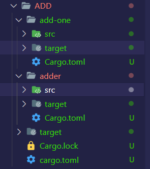

# rust

## [发布crate](https://crates.io/)

>crates.io通过发布包来共享代码

* 文档注释:
  * 用于生成文档,如果使用API
  * 可以使用`///`或者Markdown语法,放置在被说明条目之前
  * `cargo doc`:会生成html文档.Rust安装包自导的`rustdoc`工具
  * 生成的文件会在**target下的doc**中.
  * `cargo doc --open`自动打开生成的文档
    * 构建当前crate的文档(包含crate依赖项的文档)
    * 在浏览器打开文档

  ```rs
  ///  Add ones to the numbers given in the array.
  ///
  ///  # Example
  /// ```
  /// let arg = 5;
  /// let answer = hello_world::add_one(arg);
  /// assert_eq!(answer, 6);
  /// ```
  
  pub fn add_one(x: i32) -> i32 {
    x + 1
  }
  ```

> 常用章节

* 其它常用的章节:
  * `Panics`:函数可能发生panic的场景
  * `Errors`:如果函数返回Result,描述可能错误的种类,以及可导致错误的条件
  * `Safety`:如果函数处于unsafe调用,就应该解释函数unsafe的原因,以及调用者确保使用的前提
* 使用`cargo test`可以测试文档注释

* 为包含注释的项添加文档注释
  * `//!`:通常用描述crate和模块
  * 例如`crate root`(src/lib.rs)
  * 或者一个模块内,将crate或一个整体作为记录

```rs
//! # My Crate
//! 
//! `my_crate` is a collection of utilities to make performing certain
//! calculations more convenient.

///  Add ones to the numbers given in the array.
///
///  # Example
/// ```
/// let arg = 5;
/// let answer = hello_world::add_one(arg);
/// assert_eq!(answer, 6);
/// ```

pub fn add_one(x: i32) -> i32 {
  x + 1
}
```

### pub use

>使用pub use导出方便使用的公共API

* crate的程序结构在开发对于开发者很合理,开发者会将程序结构分很多层,但是使用者想找到深层结构中的某个类型费劲
* `pub use`:重新导出,创建一个与内部私有结构不同的对外公共结构

```rs
//lib.rs
pub use self::kinds::PrimaryColor;
pub use self::kinds::SecondaryColor;
pub use self::utils::mix;

//main.rs
use hello_world::mix;
use hello_world::PrimaryColor;
```

* 这样写,doc出的文档层次结构会更加清晰.并且可以更简单的调用

### 发布

1. 在`cargo.toml`中的name字段首先要是独一无二的
2. `description`:描述语句
3. `license`(许可证):<https://spdx.org/licenses/>.多个许可证需要`OR`隔开
4. 发布命令:`cargo publish`.需要`cargo login`登录

* 发布到crates.io是永久性的,该版本为无法覆盖,代码无法删除

* 如果需要发布新版本,修改`cargo.toml`中的version版本
* 参考:<https://semver.org/>

* `cargo yank`:从Crates.io撤回版本
  * 防止新项目依赖于该版本,已经存在项目可以继续将其作为依赖
  * yank意味所有已经产生`cargo.lock`的项目不会终端,但是任何将来生成的`cargo.lock`文件都不会使用被yank的版本
    * 命令`cargo yank --vers 1.0.1`,不会删除任何代码
    * 取消yank:`cargo yank --vers 1.0.1 --undo`

## cargo工作空间(workspace)

* cargo工作空间:帮助管理多个相互关联且需要协同开发的crate
* cargo工作空间是一套共享同一个`cargo.lock`和输出文件夹的包

>创建工作空间

* 多种方式创建工作空间:1个二进制crate,2个库crate
  * 二进制crate:main函数,依赖于其它两个库crate
  * 其中一个库crate,提供add_one函数
  * 另一个库crate,提供add_two函数

* 在工作空间种只有一个`cargo.lock`文件,在工作空间的顶层目录
  * 工作空间会保证工作空间内所有crate使用的依赖版本都是相同的
  * 但是需要为每一个crate添加需要对应的包,不会相互关联(版本可以不同)



1. 需要在顶层的`cargo.toml`中编写workspaces

   ```toml
   [workspace]
   
   members=[
     "adder",
     "add-one"
   ]
   ```

2. `add-one`是lib crate,编写测试代码

   ```rs
   pub fn add_one(x: i32) -> i32 {
    x + 1
   }
   ```

3. 在adder种引用add-one中的代码,首先需要在`cargo.toml`中添加依赖

   ```toml
   [package]
   name = "adder"
   version = "0.1.0"
   edition = "2021"
   
   [dependencies]
   add-one = { path = "../add-one" }
   ```

   * 然后才可以在main.rs中引用

   ```rs
   use add_one;

   fn main() {
       let num =10;
       println!("Hello, world!");
       println!("{}",add_one::add_one(num));
   }
   ```

4. `cargo build`编译工作空间的代码,并且会在顶层目录生成target
   * `cargo run -p adder`,运行工作空间(target)的二进制代码

* 在工作空间运行`cargo test`,会运行所有测试.
  * 可以使用`cargo test -p 指定crate`,运行指定的测试

## rustup

> rustup像node中的nvm一样,管理rust的安装以及附加目标(如wasm)以及核心工具(如cargo ,npm,eslint等)

* `rustup show`:显示当前安装的内容
* `rustup completions`:可以帮助启用一些工具的 CLI 的语法自动补全，比如rustup和cargo
* `rustup component`:可以允许添加额外的组件
* `rustup update`:可以更新到最新版
* `rustup install stable|nightly|1.57`:可以安装一些特定的版本，或者是最新的稳定版/每夜版

* `rust-toolchain.toml`:配置各自不同的工具链或者Rust版本.可以指定项目的工具链、打包目标、支持工具等，这样cargo和rustup可以自动地运行起来

```toml
[toolchain]
channel = "1.56.0"
components = [ "rustfmt", "clippy" ]
```

### cargo

>rust中会使用`cargo init`初始化一个项目或者`cargo new`初始化一个新的目录

#### cargo install

>cargo install是安装全局的工具,相当于`npm install package -g`

* 只能安装具有二进制目标(binary crate)的crate
* 限制:只能安装具有二进制目标(binary target)
  * 二进制binary target是一个可运行的程序,拥有`src/main.rs`或其它被指定为二进制文件的crate生成
* README:关于crate的描述.拥有`library target`或者拥有`binary target`或者两者兼备

* `cargo install`安装的二进制存放在根目录的bin文件夹
* 如果你拥有rustup安装的Rust,没有任何自定义配置,二进制存放的目录是`$HOME/.cargo/bin`
* 查看环境变量`echo $PATH`,windows使用`echo %PATH%`

> 安装依赖.

* 首先`cargo install cargo-edit`,安装这个工具包(可能会有很多奇怪的错,多试试)
* 这个工具包会提供四个命令`add`,`rm`,`upgrade` 和 `set-version`

> `cargo uninstall`:删除所有install的安装包

* `cargo uninstall [options] [spec...]`
  * `-p/--package 包名`:要卸载的包
  * `--bin 名称...`仅卸载二进制名称
  * `--root 目录`要从中卸载软件包的目录

>`cargo search [options] [query...]`:会对<https://crates.io>进行搜索有没有这个包

* `--limit`:限制结果数(默认值:10，最大值:100)
* `--index` 要使用的包的URL地址

#### 自定义命令扩展cargo

* cargo可以使用子命令来扩展,如果`$PATH`中的某个二进制是`cargo-something`,你可以像子命令一样`cargo something`运行
* `cargo --list`可以列出所有这样的命令
