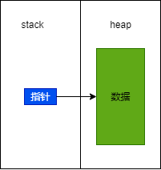
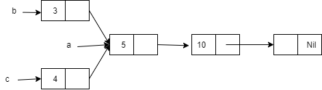
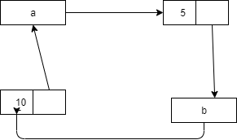

# rust

## 智能指针

>智能指针的行为和指针相似,有额外的元数据和功能

1. 引用计数智能指针类型
   * 通过记录所有者的数量,使一份数据被多个所有者同时持有
   * 并在没有任何所有者的情况下自动清理数据
2. 引用智能指针的不同
   * 引用值借用数据.智能指针很多时候拥有它指向的数据
3. 智能指针例子:`String`,`Vec<T>`
   * 拥有一片内存区域,且允许用户对其操作
   * 拥有元数据(例如容量等)
   * 提供额外的功能或者保障(String保障其数据是合法的UTF-8编码)

>智能指针的实现

* 智能指针通常使用struct实现,并且实现:`Deref`和`Drop`这两个trait
  * `Deref trait`:允许智能指针struct的实例像引用一样使用
  * `Drop trait`:允许自定义当智能指针实例走出作用域的代码

> 常用智能指针

1. `Box<T>`:在heap内存上分配值
2. `Rc<T>`:启用多重所有权的引用计数类型
3. `Ref<T>`和`RefMut<T>`,通过`RefCell<T>`访问:运行时而不是编译时强制借用规则类型

* 内部可变模式(interior mutability pattern):不可变类型暴露出可修改其内部值的API

### Box<T>

* **Box<T>**是最简单的智能指针
  * 允许你在heap上存储数据(而不是stack).stack上是指向heap上数据的指针,没有性能开销.也没有其它额外功能
  * 
* 常用的情况
   1. 在编译时,某类型的大小无法确定.但使用该类型时,上下文需要知到它的确切大小
   2. 当你拥有大量数据,想移交所有权,但需要确保在操作时数据不会被复制
   3. 使用某个值时,你只关心它是否实现了特定的trait,而不关心它的具体类型

```rs
//离开作用域会释放stack上的指针和heap上的数据
let b =Box::new(5);
println!("b = {}",b);
```

> 使用Box赋能递归类型

* 在编译时,rust需要知到一个类型的所占空间大小.但是递归类型的大小无法在编译时确定
  * 使用Box可以解决
  * `Cons List`时来自Lisp(函数式)语言的一种数据结构
    * 成员有两个元素组成,**当前项和下一个元素**
    * `Cons List`最后一个成员只包含一个Nil(终止标记).没有下一个元素
* 当然最常用的集合`Vec<T>`是最好的选择

* 创建一个`Cons List`:由于Box<T>是一个指针,rust知到他需要的空间大小
  * 指针的大小不会基于它指向数据大小变化而变化
  * 他只提供了间接存储和heap内存分配的功能,没有其它额外功能.没有性能开销.适用于间接存储的场景

```rs
use crate::List::{Cons, Nil};
fn main() {
  let list = Cons(1, Box::new(Cons(2, Box::new(Cons(3, Box::new(Nil))))));
}
enum List {
  Cons(i32, Box<List>),
  Nil,
}
```

### Deref Trait

* 实现`Deref Trait`可以<span style="color:red">自定义解引用运算符`*`的行为</span>
* 通过实现Deref.智能指针可以项常规引用一样来处理

>解引用运算符

```rs
  let x = 5;
  let y = &x;
  assert_eq!(5, x);
  assert_eq!(5, *y);
```

* `*y`如果没有解引用运算符,指向的是引用地址,无法比较

```rs
//这样也没有任何问题
  let x = 5;
  let y = Box::new(x);
  assert_eq!(5, x);
  assert_eq!(5, *y);
```

>定义自己的智能指针

* `Box<T>`被定义成拥有一个元素的tuple struct
* `Deref Trait`需要我们实现一个`deref`方法:
  * 该方法借用self,返回一个指向内部数据的引用

```rs
use std::ops::Deref;
struct MyBox<T>(T);
impl<T> MyBox<T> {
    fn new(x: T) -> MyBox<T> {
        MyBox(x)
    }
}

//实现了Deref trait才可以使用*
//\*y相当于*(y.deref()),rust会隐式展开
impl<T> Deref for MyBox<T> {
    type Target = T;
    fn deref(&self) -> &T {
      //返回的是第0个元素的引用
        &self.0
    }
}
```

> 函数和方法的隐式解引用转化(Deref Cocercion)

* 隐式解引用转化是为函数和方法提供的一种便捷特性
* 假设T实现了`Deref trait`:Deref Cocercion可以把T的引用转化为T经过Deref操作后生成引用
* 当把某类型的引用传递给函数或者方法时,但他的类型与定义的参数类型不匹配,(Deref Cocercion)就会自动发生

```rs
fn hello(name:&str){
  println!("Hello, {}!", name);
}
fn main() {
  let m = MyBox::new(String::from("Rust"));
  //&m MyBox<String>的一个引用
  //rust可以 调用 deref方法将他转换为&String
  //并且&String也是实现deref trait的,并且返回&str
  hello(&m);
}
```

* 解引用与可变性
* 可以使用`DerefMut trait`重载可变引用的`*`运算符
* 在类型和trait在下列三种情况可以发生Deref Cocercion
  1. 当T实现:Deref<Target=U>,允许&T转换为&U
  2. 当T实现:DerefMut<Target=U>,允许`&mut T`转换为`&mut U`
  3. 当T实现:Deref<Target=U>,允许`&mut T`转换为`&U`,但是反过来不行

### Drop Trait

* 实现Drop Trait,可以自定义当值将要离开作用域时发生的动作
  * 例如文件,网络资源释放
  * 任何类型都可以实现Drop trait
* Drop Trait只要你实现drop方法
  * 参数:对self的可变引用
  * 并且Drop Trait在预导入模块(prelude)

```rs
struct CustomSmartPointer {
    data: String,
}

impl Drop for CustomSmartPointer {
    fn drop(&mut self) {
        println!("Dropping CustomSmartPointer with data `{}`!", self.data);
    }
}

fn main(){
  let c = CustomSmartPointer{data:String::from("my stuff")};
  let d = CustomSmartPointer{data:String::from("other stuff")};
  println!("CustomSmartPointers created.");
}
```

>使用 std::menm::drop来提前drop值

* 很难直接禁用自动drop功能,也没有必要.Drop Trait的目的就是进行自动的释放处理逻辑
* rust不允许使用手动调用Drop Trait的释放处理逻辑
  * 例如上面的`c.drop()`会报错
* 但是可以使用`std::menm::drop`函数,drop函数(并且drop()在预导入模块)
  * 例如:`drop(c);`

## Rc<T>

>Rc<T>引用计数的智能指针

* 一个值会拥有多个所有者(例如图的结构).
* 为了支持多重所有权:Rc<T>,reference sounting(引用计数).追踪所有到值的引用
* 如果0个引用会自动清掉

>使用场景

* 需要在heap上分配数据,这些数据被程序的多个部分读取(只读).但在编译时无法确定那个部分最后使用完这些数据
* 只适用于单线程

* Rc<T>不在预导入模块(predule)
  1. `Rc::clone(&a)`函数:增加引用计数
  2. `Rc::strong_count(&a)`:获得引用计数(强引用)
     * `Rc::weak_count`:弱引用计数

* 
* 两个List共享另一个List

```rs
use std::rc::Rc;
enum List {
  Cons(i32, Rc<List>),
  Nil,
}
use crate::List::{Cons, Nil};
fn main() {
  let a = Rc::new(Cons(5, Rc::new(Cons(10, Rc::new(Nil)))));
  println!("count after creating a = {}", Rc::strong_count(&a)); //1

  //a.clone()和Rc::clone(&a)的区别是Rc::clone(&a)是拷贝指针，而a.clone()是深度拷贝
  let b = Cons(3, Rc::clone(&a));
  println!("count after creating b = {}", Rc::strong_count(&a)); //2

  {
    let c = Cons(4, Rc::clone(&a));
    println!("count after creating c = {}", Rc::strong_count(&a)); //3
  }
  println!("count after c goes out of scope = {}", Rc::strong_count(&a)); //2
}
```

>Rc<T>**通过不可变引用**,使你可以在程序不同部分之间共享只读数据

## RefCell<T>

* 内部可变性(interior mutability)
* 它允许你在支持有不可变引用的前提下对数据进行修改
  * 数据结构中使用了**unsafe**代码来绕过Rust正常的可变性和借用规则
* 与`Rc<T>`一样,`RefCell<T>`只能用于单线程场景

>与`Rc<T>`不同,RefCell<T>类型代表了其持有数据的唯一所有权

* Ref<T>与Box<T>的区别

| Box<T>                   | RefCell<T>               |
| ------------------------ | ------------------------ |
| 编译阶段强制代码遵守借用 | 只会在运行时检查借用规则 |
| 否则出现错误             | 否则触发panic            |

* 借用规则在不同阶段进行检查的比较

* 编译阶段:尽量暴露问题,没有任何运行时开销,对大多数场景是最佳选择,是Rust的默认行为
* 运行时:问题暴露延后甚至到生产环境,因为借用计数产生些许性能损失.
  * 实现某些特定的内存安全场景(不可变环境中修改自身数据)

>如何选择

|                  | Box<T>          | Rc<T>      | RefCell<T>      |
| ---------------- | --------------- | ---------- | --------------- |
| 同一数据的所有者 | 一个            | 多个       | 一个            |
| 可变性           | 可变,不可变借用 | 不可变借用 | 可变,不可变借用 |
| 借用检查         | 编译时          | 编译时     | 运行时          |

>内部可变性.然可变的借用一个不可变的值

```rs
let x =5;
//不可借用
//let y =&mut x;
```

>使用RefCell<T>在运行时记录 借用信息

1. `borrow()`方法:返回智能指针Ref<T>,它实现了Deref
2. `borrow_mut()`:返回智能指针RefMut<T>,它实现了Deref

* RefCell<T>会记录当前存在多少个活跃的Ref<T>和RefMut<T>智能指针
  * 每次调用borrow:不可变借用计数`+1`
  * 任何一个Ref<T>的值离开作用域被释放时:不可变借用计数`-1`
  * 每次调用borrow_mut:可变借用计数`+1`
  * 任何一个RefMut<T>的值离开作用域被释放时:可变借用计数`-1`

* 任何一个给定的时间里,只允许拥有多多个不可变借用和一个可变借用
* 如果违背这个规则,那么rust会在运行时触发这个panic!

>Rc<T>和RefCell<T>结合使用,实现一个拥有多重所有权的可变数据

```rs
#[derive(Debug)]
enum List {
  Cons(Rc<RefCell<i32>>, Rc<List>),
  Nil,
}

use crate::List::{Cons, Nil};
use std::cell::RefCell;
use std::rc::Rc;

fn main() {
  let value = Rc::new(RefCell::new(5));
  let a = Rc::new(Cons(Rc::clone(&value), Rc::new(Nil)));
  let b = Cons(Rc::new(RefCell::new(6)), Rc::clone(&a));
  let c = Cons(Rc::new(RefCell::new(10)), Rc::clone(&a));

  *value.borrow_mut() += 10;

  println!("a after = {:?}", a);
  println!("b after = {:?}", b);
  println!("c after = {:?}", c);
}
```

>其他实现内部可变性的类型

* Cell<T>:通过复制来访问数据
* Mutex<T>:用于实现跨线程情形下的内部可变性模式

### 循环引用导致内存泄漏

* rust中有可能发生内存泄漏,不是不可能
* 例如引用`Rc<T>`和RefCell<T>就可能创造出循环引用,从而发生内存泄漏
  * 每个引用数量不会变成0,也不会被清除

```rs
use crate::List::{Cons, Nil};
use std::cell::RefCell;
use std::rc::Rc;
#[derive(Debug)]
enum List {
  Cons(i32, RefCell<Rc<List>>),
  Nil,
}

impl List {
  fn tail(&self) -> Option<&RefCell<Rc<List>>> {
    match self {
      Cons(_, item) => Some(item),
      Nil => None,
    }
  }
}
fn main() {
  let a = Rc::new(Cons(5, RefCell::new(Rc::new(List::Nil))));
  println!("a initial rc count = {}", Rc::strong_count(&a));
  println!("a next item = {:?}", a.tail());
  let b = Rc::new(Cons(10, RefCell::new(Rc::clone(&a))));
  println!("a rc count after b creation = {}", Rc::strong_count(&a));
  println!("b initial rc count = {}", Rc::strong_count(&b));
  println!("b next item = {:?}", b.tail());

  if let Some(link) = a.tail() {
    *link.borrow_mut() = Rc::clone(&b);
  }
  println!("b rc count after changing a = {}", Rc::strong_count(&b));
  println!("a rc count after changing a = {}", Rc::strong_count(&a));

  // Uncomment the next line to see that we have a cycle;
  // it will overflow the stack
  // println!("a next item = {:?}", a.tail());
}
```



>防止循环引用

1. 重新组织数据结构:一些引用来表殴打所有权,一些引用不表达所有权
   * 循环引用的一部分具有所有权的关系.另一部分不涉及所有权的关系
   * 而只有所有权的关系才影响值的清理
2. 将Rc<T>换成Weak<T>
   * 使用Rc:clone为Rc<T>实例的strong_count加1,Rc<T>的实例只有在strong_count为0的时候才会被清理
   * Rc<T>实例通过调用`Rc::downgrade`方法可以创建值的`Weak Reference`(弱引用)
      * 返回的类型是`Weak<T>`(智能指针)
      * 调用Rc::downgrade会为weak_count加1
   * Rc<T>使用weak_count来追踪存在多少Weak<T>
   * weak_count不为0并不影响Rc<T>实例的清理

* **Strong & Weak**
  * `Strong Reference`(强引用)是关于如何分享Rc<T>实例的所有权
  * `Weak Reference`(弱引用)并不会像上面一样
  * 使用`Weak Reference`并不会创建循环引用
    * 当`Strong Reference`数量为0的时候`Weak Reference`会自动断开
  * 在使用Weak<T>前,需要保证它指向的值任然存在:
    * 在Weak<T>实例上调用upgrade方法,返回Option<Rc<T>>

```rs
use std::cell::RefCell;
use std::rc::{Rc, Weak};

#[derive(Debug)]
struct Node {
  value: i32,
  parent: RefCell<Weak<Node>>,
  children: RefCell<Vec<Rc<Node>>>,
}

fn main() {
  let leaf = Rc::new(Node {
    value: 3,
    parent: RefCell::new(Weak::new()),
    children: RefCell::new(vec![]),
  });
  //println!("leaf parent = {:?}", leaf.parent.borrow().upgrade());
  println!(
    "leaf strong = {},weak = {}",
    Rc::strong_count(&leaf),
    Rc::weak_count(&leaf)
  );
  {
    let branch = Rc::new(Node {
      value: 5,
      parent: RefCell::new(Weak::new()),
      children: RefCell::new(vec![Rc::clone(&leaf)]),
    });

    *leaf.parent.borrow_mut() = Rc::downgrade(&branch);
    //println!("leaf parent = {:?}", leaf.parent.borrow().upgrade());
    println!(
      "branch strong = {},weak = {}",
      Rc::strong_count(&branch),
      Rc::weak_count(&branch)
    );
    println!(
      "leaf strong = {},weak = {}",
      Rc::strong_count(&leaf),
      Rc::weak_count(&leaf)
    );
  }
  println!("leaf parent = {:?}", leaf.parent.borrow().upgrade());
  println!(
    "leaf strong = {},weak = {}",
    Rc::strong_count(&leaf),
    Rc::weak_count(&leaf)
  );
}
```
